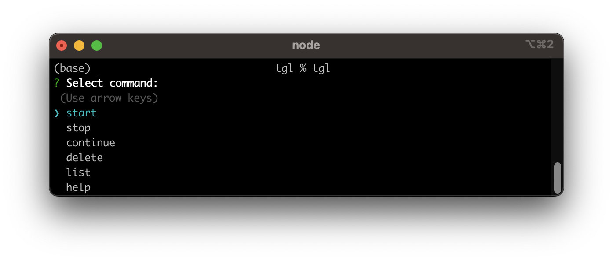

# tgl: A Simple "Toggle Track" CLI Tool

`tgl` is a minimalistic clone of "Toggle Track", but designed exclusively as a CLI tool. It's built using Node.js.

With `tgl` you can time track right from your terminal.

## Installation

To install `tgl` globally:

```bash
npm install -g tgl
```


## Usage

Here are the basic commands:
```bash
tgl
tgl start I`m working on ... @ Add a project # Add tags

tgl stop
tgl delete
tgl list
tgl help
```



> Note: The "working on" title (e.g., "I'm working on ...") cannot include # or @.


## Settings

All "Toggle Track" configurations are found in the settings.json file. Currently, the supported settings include:

- **workspace** (default: "this")
- **name**
- **durationFormat** (default: "improved")
    - classic (47:06 min)
    - improved (0:47:06)
    - decimal (0.79 h)

## Dependencies
`tgl` relies on a few crucial Node.js libraries to function smoothly. Here are the main dependencies

- **inquirer**: Version ^9.2.10
    - Purpose: To facilitate interactive command-line prompts and questions.

## Future Features (Outlook)

- Generate start links and qr codes
- Import / export features
- "Focus time" timer
- Enhanced collaborative features, like a shared database
- Option to connect to your database.
- Improved local UI Overview

## Contribution & Support

You want to make a change? All contributions are warmly welcomed, whether it's bug reports, feature requests, or code contributions.